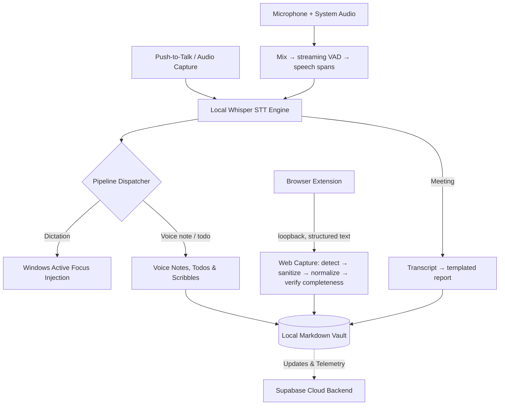

# Vox _(vox-workspace)_

> Hybrid (local-first + cloud) AI voice and memory assistant for Windows — turns push-to-talk speech into text in any app, voice notes, todos and meeting reports, without cloud lock-in.

[](https://github.com/Nitinsudarshan/Vox/actions/workflows/ci.yml)
[](LICENSE)

> [!NOTE]
> **Status: Pre-Alpha / Active Development**  
> Vox is under active development and is not yet recommended for production use.

## Why Vox

Traditional dictation tools stream raw audio to third-party clouds and leave you with walls of transcript text that require manual re-reading and manual copying.

Vox transcribes speech on your machine and turns it into text typed where you are working, todos, and grounded vault notes. Audio never leaves the machine, and neither does text unless you choose a cloud model provider for reports, enrichment or the opt-in dictation cleanup.

## Features

- **Home** — The surface Vox opens on: every capture mode one click away, live counts of what is in your vault (voice notes, scribbles, documents, captures, entities, connections, memories) with a seven-day delta, the newest records across every surface, and an honest readout of what is configured on this machine — a missing language model or speech engine says so, next to the way to fix it. Every number is read from the local vault, not from a separate statistics store.
- **Knowledge Graph** — A first-class surface, not a tab inside Scribbles: the whole Obsidian-compatible graph of thoughts, topics, entities and sources in one 2D canvas with real force physics, filters, groups, per-node inspection, and connect/merge actions. Double-clicking a thought opens it in Scribbles.
- **Universal Dictation** — Transcribes push-to-talk audio and injects text directly into whatever Windows app or field has active focus. Nothing leaves the machine by default: an AI cleanup pass (Faithful, Clean, Polished or Concise) is opt-in, adds at most five seconds, and the original transcript is kept beside the cleaned one so every change can be reviewed.
- **Model Providers** — Vox installs Ollama for you when it is missing, then starts it and pulls models without a terminal. Reports and analysis run through Ollama on this machine, OpenAI, Anthropic, Gemini, Groq, OpenRouter, or any server speaking the OpenAI chat-completions API at an address you give — vLLM, LM Studio, LiteLLM, Azure OpenAI, no code change. API keys are kept per provider in the operating system's credential store (Windows Credential Manager), never in the settings file and never handed back to the UI, so switching between two to compare them does not lose the first one, and Vox refuses to send a key unencrypted to a plain-HTTP endpoint that is not on this machine. A machine with nothing configured gets a message naming the fix rather than a transport error.
- **Parakeet TDT (the `parakeet` feature, on by default)** — NVIDIA's transducer ASR through ONNX Runtime, the engine Meetily transcribes with by default: at int8 it decodes considerably faster than Whisper's larger models, and its duration head skips most encoder frames rather than stepping through them. Selectable for dictation in Settings › Speech models; whether ONNX Runtime survives Windows packaging is still unproven ([`docs/spikes/onnx-windows.md`](docs/spikes/onnx-windows.md)), so treat it as unverified on an installed build. The decoding and the vocabulary compile and are tested in every build regardless.
- **Speech Models** — First-run setup ends by checking you have a microphone and offering the speech model download, so nobody reaches the app with nothing to transcribe with; it is skippable, and the surfaces that need a model offer the same install when reached. Settings › Speech is the one place models are managed: the twelve whisper.cpp tiers listed with what each costs and who it suits, downloaded with live progress and cancellable mid-transfer, verified before they are moved into place, and removable. Meetings and dictation choose independently — push-to-talk is waiting for the words and cannot afford a large model, a meeting is decoded in the background and can. Nothing is bundled and nothing is fetched behind your back; a missing model is offered for install on the surface that needs it, not reported as a dead end.
- **Meetings** — Records both sides of a call: your microphone and this machine's system audio together, mixed in temporal lockstep and transcribed on device by the same local Whisper engine. A streaming voice-activity segmenter sends speech to the decoder as it is spoken, so the transcript fills in live; a WAV checkpoint every 30 seconds means a crash costs seconds rather than the meeting, and an interrupted recording is finalized on the next launch. Six JSON report templates ship (General, Standup, One-on-One, Client Call, Interview, Technical Review) and your own drop into a folder without a rebuild; reports are written in English through your configured provider and translated afterwards, with the English original cached so a second language costs one pass. Before a recording starts you choose the microphone and the output device to capture in loopback — the far end of a call arrives through whichever device you are listening on — and the level meters name what was actually opened, so "nothing heard yet" points at a device rather than a mystery. Recurring meetings are one thing rather than twelve rows: Vox reads the series identity Google puts on every occurrence of a recurring event, links each recording to the series it belongs to during a sync, and a meeting's banner says which series it is in and where it sits in it — opening the whole series, oldest first, since a series reads forwards. Recordings no calendar event covers, like imported audio, go into a series by hand, which is also how a series Google split by recreating the recurrence is put back together. The Meetings page is a list grouped by day, with today and yesterday open and older days collapsed behind their own heading and a count. Opening a meeting gives it the whole window: the banner becomes that meeting — its name, when it ran, who was in it, its recording and the actions that apply to it — and everything below is the report and the transcript, side by side on a wide screen because a report is checked against the transcript that produced it. Clicking a line's timestamp jumps the audio there and follows along. You can also import an existing recording (`.wav`, `.mp3`, `.m4a`, `.flac`, `.ogg`), or transcribe a stored one again with a language pinned, a larger model, and a slower decode — the three things that actually change a bad transcript. See [`docs/meetings.md`](docs/meetings.md).
- **Speakers** — Transcript lines are labelled **You** or **Others** from the capture channel, which is measured rather than guessed: the microphone and the loopback are two streams. Beyond that, Vox fingerprints each turn and groups the ones that sound alike, then offers a few seconds of each voice to play back so you can put a name to it. Named speakers appear in the transcript and in every report, which is what lets a report say who committed to what on a call with more than two people. This is acoustic grouping, not a trained speaker model — it will sometimes merge two similar voices — so it is presented as a proposal you correct in one click, never as an assertion. The local microphone is never split, and the two channels are never merged, so Vox cannot attribute a remote voice to you.
- **Languages and script** — A meeting is rarely in one language, and a transcript in an alphabet you cannot read is unusable. Every meeting offers up to three views. **Romanized** is computed offline by a Devanagari state machine in microseconds — the same words in Latin letters, faithful by construction, with no model involved. **English** comes from decoding the recording a second time with Whisper's own translate task, which reads the audio rather than a transcript that may already be wrong; a model pass fills whatever that missed, in validated batches, and says what it could not do instead of silently saving nothing. Reports are generated from the English rendering whatever the meeting was held in.
- **Calendar** — Connect as many Google accounts as you use. Work and personal are merged into one day rather than kept apart, an invitation that reached both inboxes appears once, and each recording is matched to the event it overlaps so a meeting carries its real name and guest list instead of the time it was recorded. Each account has its own colour with a key naming which is which, so a merged agenda can still be read. Today and tomorrow sit on the Meetings page — including the meetings that have already finished, dimmed rather than dropped, because "did the 10:30 happen, and did I record it?" is asked at 11 — and the whole week opens from the banner; a meeting you declined is struck through the way Google draws it and stays joinable, since dropping into one meeting of a series you declined is normal. Clicking a meeting opens it in full — when it runs for, the whole guest list rather than "+14", where it is, and the invitation's own notes as text, since what somebody else wrote in a calendar is shown and never interpreted — with Join and Join-and-record on it, the second of which opens the call and starts recording it under the meeting's real name in one press. A video link stays live for the whole of its own day, because calls break and resume on the same link. Vox opens links through the OS browser and refuses anything that is not a web address on one of your own events. Vox also raises a reminder card in a window of its own — undecorated, always on top, off the taskbar, top-right, and kept out of screen shares — carrying **Record**, **Join** and **Snooze**. Not a Windows toast: the desktop notification plugin maps title, body and icon and silently drops actions, so a toast can announce a meeting but can never carry a button, and a reminder you cannot act on is not the feature. Three kinds, each its own switch: **before a meeting starts**; **when one is running unrecorded**, which needs the call to actually be open on screen, because a meeting you left is not one you forgot to record; and **a detected call** the calendar knows nothing about, found by reading conferencing window titles (Windows only, and off unless you ask for it). Hovering the card pauses its countdown; Join re-arms it a minute later, since opening the call did not record it. Settings › Developer raises any of the three through the same path. While a recording runs, a pill sits on the right edge of the screen with the elapsed time and a live waveform — you above the centreline, the meeting below it — and opens pause and stop inside itself on hover. Access is read-only: Vox cannot create, change or delete anything in your calendar. Events are cached locally so the day renders without waiting for Google, an account that needs reconnecting is reported against that account rather than emptying the whole agenda, and re-syncing is a button on the Meetings page rather than a trip through Settings.
- **Knowledge Architecture (Foundation 11–20)** — Connected, explainable knowledge system combining multi-signal unified retrieval (Vault files, web captures, scribbles, derived artifacts, memories), persistent entity resolution, operational relationship linking, deliberate memory formation with conflict superseding, bounded canonical context packs with prompt boundary isolation, and truthful universal actions with enforced confirmation gating.
- **Scribbles and Todos** — A voice note added to Scribbles is enriched with a title, summary, topics and entities and joins the knowledge graph; a task spoken on the TODOs page becomes a todo that points back at the recording.
- **AI Conversation Capture & Import** — Saves the web page or AI conversation you are looking at into your vault as structured text, not a screenshot: live turn-by-turn capture from ChatGPT, Claude, and Gemini, repositories, issues and pull requests from GitHub, and article text, tables, code and metadata from anything else. Vox also supports **AI Conversation Import**, ingesting official data export packages (.zip or .json) from ChatGPT and Claude, extracting and preserving working assets (PDFs, code, images, docs) in the local vault, and linearizing conversation branches into immutable source material. Vox extracts a canonical derived context model from captured and imported conversations—grounding settled decisions, requirements, boundaries/constraints, open questions, and next actions with source-turn provenance. It reads more than the screen: Vox scrolls a long conversation from its start, waits for content that loads as you go, and opens sections that are genuinely collapsed — then puts your scroll position back. Captured pages are stored as external source material, never as instructions to Vox's AI. See [`docs/capture.md`](docs/capture.md).
- **Document Vault & Files** — Import `.md`, `.txt`, `.pdf`, and `.docx` documents into Vox's vault with a 100% non-destructive immutability guarantee for your original files. Vox extracts text, generates AI summaries, derives topics and named entities, supports linked Scribbles, and cites documents in knowledge context.
- **Diagnostics & Observability Hub** — Dedicated technical testing and inspection workspace featuring real-time audio telemetry (RMS, peak amplitude, VAD segmentation, decoding diagnostics), STT accuracy benchmarking against reference corpora, live LLM prompt latency testing, verified disk-level model readiness, and speech gating diagnostics.
- **Local Vault Storage** — Saves audio recordings, transcripts, and structured entities locally as Markdown files with YAML frontmatter.

## Requirements

- **Node.js**: `20+`
- **Rust**: `1.98.0`, pinned in [`native/src-tauri/rust-toolchain.toml`](native/src-tauri/rust-toolchain.toml) and installed by rustup on the first `cargo` call
- **OS**: Windows 10/11 (with WebView2 runtime)

## Install

```bash
npm run install:all
```

## Quick start

Run the native desktop application in development mode:

```bash
npm run dev:native
```

To build the Vox Capture browser extension (Chrome or Edge), then load
`native/browser-extension` unpacked from `chrome://extensions`:

```bash
cd native && npm run build:extension
```

Pair it from **Vox → Settings → Capture**;
[`native/browser-extension/README.md`](native/browser-extension/README.md) has
the full walkthrough.

## How it works



## Tests

```bash
# Rust backend — about 1,250 tests
cd native/src-tauri && cargo clippy --all-targets -- -D warnings && cargo test

# Native frontend — 710 tests
cd native && npm test && npm run typecheck

# Transcription harness — 28 tests, no model or corpus required
npm run test:transcription
```

CI runs all of these on every push and pull request
([`.github/workflows/ci.yml`](.github/workflows/ci.yml)), with the Rust
checks on both Linux and Windows, and builds the browser extension. Dependency
advisories are checked by
[`.github/workflows/security.yml`](.github/workflows/security.yml) weekly and
whenever a lock file changes. See [`docs/testing.md`](docs/testing.md) for what
is covered and what is not.

Building the Rust crate needs a C/C++ toolchain and CMake for whisper.cpp. On
Linux it also needs the GTK/WebKit and ALSA development headers — the CI
workflow's `system dependencies` step is the authoritative list.

## Contributing

Contributions are welcome — please read [`AGENTS.md`](AGENTS.md) for coding conventions and repository rules before opening a pull request, and [`docs/README.md`](docs/README.md) for the documentation map.

## License

Vox is licensed under the GNU Affero General Public License v3.0.
See [LICENSE](LICENSE) for the complete license text.

