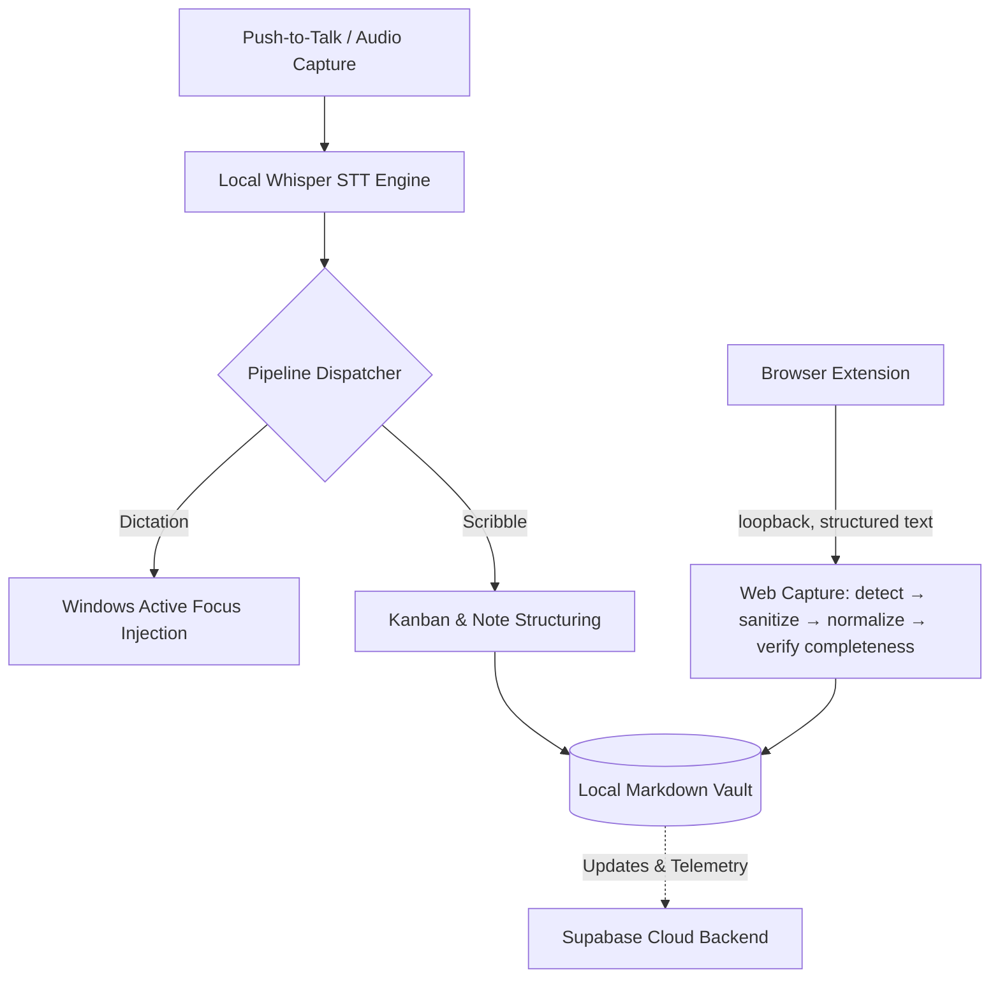

# Vox _(vox-workspace)_

> Hybrid (local-first + cloud) AI voice and memory assistant for Windows — turns push-to-talk speech into structured Kanban cards, markdown notes, and direct dictation without cloud lock-in.

[](https://github.com/Nitinsudarshan/Vox/actions/workflows/ci.yml)
[](LICENSE)

> [!NOTE]
> **Status: Pre-Alpha / Active Development**  
> Vox is under active development and is not yet recommended for production use.

## Why Vox

Traditional dictation tools stream raw audio to third-party clouds and leave you with walls of transcript text that require manual re-reading and manual copying.

Vox processes speech locally using Whisper and structured pipelines to instantly convert spoken thoughts into organized Kanban tasks and grounded vault notes while keeping all audio and notes strictly on your machine.

## Features

- **Home** — The surface Vox opens on: every capture mode one click away, live counts of what is in your vault (voice notes, scribbles, documents, captures, entities, connections, memories) with a seven-day delta, the newest records across every surface, and an honest readout of what is configured on this machine — a missing language model or speech engine says so, next to the way to fix it. Every number is read from the local vault, not from a separate statistics store.
- **Knowledge Graph** — A first-class surface, not a tab inside Scribbles: the whole Obsidian-compatible graph of thoughts, topics, entities and sources in one 2D canvas with real force physics, filters, groups, per-node inspection, and connect/merge actions. Double-clicking a thought opens it in Scribbles.
- **Universal Dictation** — Transcribes push-to-talk audio and injects text directly into whatever Windows app or field has active focus.
- **Knowledge Architecture (Foundation 11–20)** — Connected, explainable knowledge system combining multi-signal unified retrieval (Vault files, web captures, scribbles, derived artifacts, memories), persistent entity resolution, operational relationship linking, deliberate memory formation with conflict superseding, bounded canonical context packs with prompt boundary isolation, and truthful universal actions with enforced confirmation gating.
- **Scribble Pipeline** — Parses rough voice scribbles into structured Kanban task cards and vault notes.
- **AI Conversation Capture & Import** — Saves the web page or AI conversation you are looking at into your vault as structured text, not a screenshot: live turn-by-turn capture from ChatGPT, Claude, and Gemini, repositories, issues and pull requests from GitHub, and article text, tables, code and metadata from anything else. Vox also supports **AI Conversation Import**, ingesting official data export packages (.zip or .json) from ChatGPT and Claude, extracting and preserving working assets (PDFs, code, images, docs) in the local vault, and linearizing conversation branches into immutable source material. Vox extracts a canonical derived context model from captured and imported conversations—grounding settled decisions, requirements, boundaries/constraints, open questions, and next actions with source-turn provenance. It reads more than the screen: Vox scrolls a long conversation from its start, waits for content that loads as you go, and opens sections that are genuinely collapsed — then puts your scroll position back. Captured pages are stored as external source material, never as instructions to Vox's AI. See [`docs/capture.md`](docs/capture.md).
- **Document Vault & Files** — Import `.md`, `.txt`, `.pdf`, and `.docx` documents into Vox's vault with a 100% non-destructive immutability guarantee for your original files. Vox extracts text, generates AI summaries, derives topics and named entities, supports linked Scribbles, and cites documents in knowledge context.
- **Diagnostics & Observability Hub** — Dedicated technical testing and inspection workspace featuring real-time audio telemetry (RMS, peak amplitude, VAD segmentation, decoding diagnostics), STT accuracy benchmarking against reference corpora, live LLM prompt latency testing, verified disk-level model readiness, and speech gating diagnostics.
- **Local Vault Storage** — Saves audio recordings, transcripts, and structured entities locally as Markdown files with YAML frontmatter.

## Requirements

- **Node.js**: `20+`
- **Rust**: `1.75+` (for native Tauri desktop backend)
- **OS**: Windows 10/11 (with WebView2 runtime)

## Install

```bash
npm run install:all
```

## Quick start

Run the native desktop application in development mode:

```bash
npm run dev:native
```

To build the Vox Capture browser extension (Chrome or Edge), then load
`native/browser-extension` unpacked from `chrome://extensions`:

```bash
cd native && npm run build:extension
```

Pair it from **Vox → Settings → Capture**;
[`native/browser-extension/README.md`](native/browser-extension/README.md) has
the full walkthrough.

## How it works



## Tests

```bash
# Rust backend — 527 tests
cd native/src-tauri && cargo clippy --all-targets -- -D warnings && cargo test

# Native frontend — 348 tests
cd native && npm test && npm run typecheck
```

CI runs all of these on every push and pull request
([`.github/workflows/ci.yml`](.github/workflows/ci.yml)). See
[`docs/testing.md`](docs/testing.md) for what is covered and what is not.

Building the Rust crate needs a C/C++ toolchain and CMake for whisper.cpp. On
Linux it also needs the GTK/WebKit and ALSA development headers — the CI
workflow's `system dependencies` step is the authoritative list.

## Contributing

Contributions are welcome — please read [`AGENTS.md`](AGENTS.md) for coding conventions and repository rules before opening a pull request, and [`docs/README.md`](docs/README.md) for the documentation map.

## License

Vox is licensed under the GNU Affero General Public License v3.0.
See [LICENSE](LICENSE) for the complete license text.

