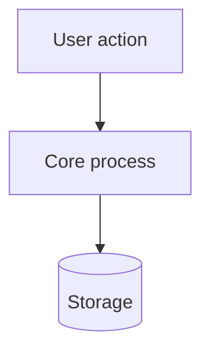
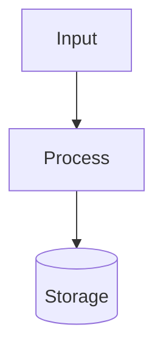

# README Authoring Rules

> Machine-readable rules for generating or rewriting a repository `README.md`.
> Intended for IDE agents (Cursor, Antigravity, Claude Code, Copilot, Windsurf) and human maintainers.
> Place at `.github/rules-readme.md`, `docs/rules-readme.md`, or reference from `AGENTS.md` / `.cursorrules`.

---

## 0. How to use this document

**Agent instruction:** When asked to create, rewrite, audit, or improve a README, follow this document in order. Do not skip Section 1 (Discovery). Do not invent facts. Every command, path, version, and feature claim in the output must be traceable to a file in the repository.

Rule keywords:
- **MUST** — non-negotiable. A README violating a MUST is rejected.
- **SHOULD** — apply unless the project has a specific reason not to.
- **MAY** — optional; include only if it earns its space.
- **NEVER** — do not do this under any circumstance.

---

## 1. Discovery phase (run before writing a single line)

The agent **MUST** gather the following from the repository before drafting. If a fact cannot be found, mark it `<!-- TODO: verify -->` in the draft and list it back to the user. **NEVER** guess.

| # | What to find | Where to look |
|---|---|---|
| 1 | Project name, canonical package name | `package.json`, `Cargo.toml`, `pyproject.toml`, `go.mod`, `pubspec.yaml`, repo slug |
| 2 | One-line purpose | package manifest `description`, existing README, repo "About", top-level doc comments |
| 3 | Language, runtime, framework, min versions | manifests, `engines`, `rust-version`, `requires-python`, `.nvmrc`, `Dockerfile`, CI matrix |
| 4 | Install method | `package.json` publish config, `Cargo.toml`, release workflow, `Dockerfile`, `install.sh`, brew formula |
| 5 | Real entry point / smallest working example | `src/index.*`, `main.*`, `bin/`, `examples/`, tests |
| 6 | Runnable scripts | `package.json` scripts, `Makefile`, `justfile`, `Taskfile`, `tauri.conf.json` |
| 7 | Required env vars / config | `.env.example`, `config/`, `settings.*`, code that reads env |
| 8 | License & trademarks | `LICENSE`, `LICENSE.md`, package manifests (`package.json`, `Cargo.toml`, etc.), `NOTICE`, `TRADEMARKS.md`, contributor docs |
| 9 | CI / badge sources | `.github/workflows/*.yml`, coverage config |
| 10 | Existing assets | `docs/`, `.github/`, `assets/`, `screenshots/` — reuse before requesting new ones |
| 11 | Contribution rules | `CONTRIBUTING.md`, `CODE_OF_CONDUCT.md`, `SECURITY.md` — link, do not duplicate |
| 12 | Project archetype | See Section 8 |

**MUST:** Every shell command written into the README must correspond to a script, binary, or published package that actually exists in the repo. If `npm run dev` is written, `dev` must be present in `package.json` scripts.

**MUST (Licensing Discovery):**
- Licensing facts are repository facts, not assumptions. The agent **MUST** inspect the actual `LICENSE` and manifest metadata before writing the license section. The agent **MUST NOT** infer the license from project discussions, previous prompts, README badges, or common conventions.
- Do not modify licensing policy merely because README generation is requested. License changes require an explicit repository-level licensing decision.
- For Vox, if AGPLv3 is intended but the `LICENSE` file does not yet exist or disagrees with AGPLv3 (e.g. still shows MIT or another license): report that the repository currently lacks or has an inconsistent license file; do **NOT** falsely claim that Vox is already AGPL-licensed; flag the missing or inconsistent license as a repository action required before the README can accurately claim AGPL licensing.

---

## 2. Core principles

1. **The README is a landing page, not documentation.** Its job is to convert a skimming visitor within ~30 seconds. Reference material lives in `docs/` or a docs site.
2. **Decreasing urgency ordering.** What a first-time visitor needs to make a go/no-go decision goes at the top. What an existing user returns to goes at the bottom or gets linked out.
3. **Completeness test.** A reader should be able to install and successfully use the project without ever opening the source. If they must read code to get started, the README is incomplete.
4. **Scannability over exhaustiveness.** There is no correct length. There is a correct density. A 50-line README for a utility is correct; a 400-line README for a framework is correct. Padding is never correct.
5. **Currency is the real differentiator.** A structurally perfect README that describes last quarter's CLI flags is worse than a plain one that is accurate. See Section 10.
6. **Write for a stranger who is comparing you to two alternatives.** Not for yourself six months ago.

---

## 3. Required section order

Sections **MUST** appear in this order. Optional sections may be omitted, never reordered.

| Order | Section | Status | Notes |
|---|---|---|---|
| 1 | Title (+ logo) | **Required** | |
| 2 | Tagline / one-line description | **Required** | Blockquote, directly under title |
| 3 | Badges | Should | 3–5 maximum |
| 4 | Hero visual (screenshot / GIF / diagram) | Should | Required if the project has any visual output |
| 5 | Table of contents | Conditional | Only if README exceeds ~2 screens (~150 lines) |
| 6 | Why / What it is | Should | The differentiator paragraph |
| 7 | Features | May | Bulleted, benefit-led, max 8 |
| 8 | Requirements / prerequisites | Conditional | Required if non-obvious runtime deps exist |
| 9 | Install | **Required** | |
| 10 | Quick start | **Required** | Smallest path to a visible result |
| 11 | Usage / examples | Should | |
| 12 | Configuration | Conditional | Collapse or link out if >15 rows |
| 13 | Architecture / how it works | May | Mermaid or prose; required for infra/tooling projects |
| 14 | Comparison / prior art | May | High value for crowded categories |
| 15 | Roadmap / status | May | Only if genuinely maintained |
| 16 | Troubleshooting / FAQ | May | |
| 17 | Contributing | Should | Link `CONTRIBUTING.md`, 2–3 lines inline |
| 18 | Security | Conditional | Required if the project handles credentials, user data, or crypto |
| 19 | License | **Required** | |
| 20 | Acknowledgements / credits | May | |

**MUST:** Title, tagline, install, and quick start together fit within the first two screens (roughly the first 120 lines of rendered output). Anything that pushes install below the fold is a defect.

---

## 4. Per-section rules

### 4.1 Title
- **MUST** be a single `#` H1, and the only H1 in the file.
- **MUST** match the repository name, folder name, and package-manager name. If a display title differs, include the canonical name in italics and parentheses beside it: `# Vox _(vox-workspace)_`.
- **MAY** be preceded by a centered logo block. If a logo is used, cap width at ~200px and provide `alt` text.

### 4.2 Tagline
- **MUST** be one sentence, on the line after the title, formatted as a blockquote (`>`).
- **MUST** answer three things: *what it is*, *who it is for*, *why it is different*.
- **NEVER** write category-only descriptions. `A tool for developers`, `A modern library`, `A simple app` are rejected.
- Good shape: `Local-first meeting transcription for people who don't want a bot in the call — captures system audio directly, stores everything on your machine.`

### 4.3 Badges
- **SHOULD** be 3–5. **NEVER** exceed 6.
- **MUST** only include badges that answer a question an evaluator actually asks: build/CI status, release version, license, and at most one community link (Discord/Matrix) if a community exists.
- **NEVER** include: download counts, code coverage percentage, "made with love", "PRs welcome", language logos, lines-of-code, visitor counters, technology-stack badge rows. Long badge rows are read as AI-generated filler and lower perceived quality.
- **MUST** be functional — every badge links to the thing it reports (CI badge → workflow runs, version badge → registry page).
- Use `shields.io`. Keep `style=` consistent across all badges in the file.
- **MUST NOT** show a badge for a workflow or registry that does not exist.

### 4.4 Hero visual
- **MUST** be included if the project produces any visible output (GUI, CLI, web UI, generated artifact).
- **MUST** sit above the install section.
- One visual, not three. Pick the single most representative interaction.
- **GIF rules:** under 2 MB ideally, hard cap 5 MB; 5–15 seconds; trimmed hard. Larger files fail on mobile connections and the visitor leaves before the demo loads.
- **CLI projects MUST** use a terminal recorder (VHS from charm.sh, or asciinema) — **NEVER** a phone or window screen recording.
- **GUI projects** use Kap (macOS) or ScreenToGif (Windows).
- **MUST** host the asset inside the repo (`docs/`, `assets/`, or `.github/`) — **NEVER** Imgur, Giphy, Dropbox, or a personal CDN. External hosts rot and break the README.
- **MUST** provide meaningful `alt` text.
- **SHOULD** provide a static fallback image; some readers disable animated GIFs.

### 4.5 Table of contents
- Include only when the rendered README exceeds ~2 screens.
- **MUST** link to real anchors; broken anchors are a defect.
- Depth 2 only (H2 headings). **NEVER** nest to H4.
- Note: GitHub renders an automatic outline in the sidebar, so a manual TOC is redundant for short files.

### 4.6 Why / What it is
- 2–4 sentences of plain prose. This is the section that earns the star.
- **MUST** state the problem before the solution.
- **SHOULD** name the constraint or design decision that makes the project different (local-first, zero-config, no runtime deps, single binary, offline-capable).

### 4.7 Features
- Maximum 8 bullets. Beyond 8, nobody reads them.
- **MUST** be benefit-led, not implementation-led. `Works offline — no account required` beats `Uses SQLite`.
- **MUST** be bold-lead formatted: `- **Short label** — one clause of explanation.`
- **NEVER** list a feature that is not implemented on the default branch. Planned work belongs in Roadmap, explicitly marked.

### 4.8 Requirements
- **MUST** state exact minimum versions found in Discovery, not vague ones. `Node.js 20+` not `a recent Node`.
- **MUST** list OS constraints if the project is not cross-platform.
- **SHOULD** list system-level dependencies that are not installed by the package manager (Rust toolchain, ffmpeg, build-essential, WebView2, Xcode CLT).

### 4.9 Install
- **MUST** be a single copy-pasteable fenced block per method, with a language tag (`bash`, `powershell`, `sh`).
- **NEVER** interleave prose between the lines of one command sequence. Prose goes above or below the block.
- **NEVER** prefix commands with `$` — it breaks copy-paste.
- Multiple install paths (npm / brew / Docker / binary / source) **MUST** be split into tabs-by-collapsible or clearly labelled H3s, with the recommended path first.
- **SHOULD** put source-build instructions in a `<details>` block; most visitors want the package, not the build.

### 4.10 Quick start
- **MUST** produce a visible, verifiable result in the fewest steps possible.
- **MUST** show expected output where output exists — a code block with the result, or a screenshot.
- **MUST** be runnable verbatim after the Install section, with no undocumented prerequisites.
- Keep to one scenario. Additional scenarios belong under Usage.

### 4.11 Usage / examples
- Real, runnable examples only. **NEVER** pseudo-code, **NEVER** `foo`/`bar` when a domain term is available.
- **SHOULD** progress from simplest to most involved.
- **SHOULD** link to `examples/` in the repo rather than inlining more than ~3 examples.

### 4.12 Configuration
- **SHOULD** be a table: `Option | Type | Default | Description`.
- **MUST** collapse into `<details>` or move to `docs/configuration.md` if it exceeds ~15 rows. Long parameter tables bury everything that sells the project.
- **MUST** mark required options explicitly.
- **NEVER** include real secrets, tokens, keys, internal URLs, or production hostnames — use obvious placeholders (`<YOUR_API_KEY>`).

### 4.13 Architecture
- **SHOULD** use a Mermaid block for system/data flow (see 5.3).
- Keep to one diagram. Deep architecture belongs in `docs/architecture.md`.
- **SHOULD** include a short directory-layout block for projects a contributor is expected to navigate.

### 4.14 Comparison / prior art
- High-value in crowded categories. **MUST** be fair — a comparison table that makes every competitor look bad is read as marketing and discounted.
- **SHOULD** include a "when not to use this" line. It builds more trust than any feature list.
- **NEVER** cite competitor metrics without a source or date.

### 4.15 Contributing
- 2–3 lines inline plus a link to `CONTRIBUTING.md`. **NEVER** duplicate the full contributing guide in the README.
- **SHOULD** name the fastest useful contribution (good-first-issue label, docs, translations).

### 4.16 License
- **MUST** state the actual SPDX identifier detected from the repository and link the `LICENSE` file: `<SPDX identifier> © <year> <copyright holder> — see [LICENSE](LICENSE).`
- For Vox, the expected identifier is `AGPL-3.0-only` unless the repository's actual `LICENSE` file establishes a different valid AGPL variant.
- The README license statement **MUST** match:
  1. the `LICENSE` file,
  2. package/manifests where applicable,
  3. repository metadata,
  4. the actual selected SPDX identifier.
- The README **MUST** link to the repository's `LICENSE` file.
- The agent **MUST NOT** substitute MIT, Apache-2.0, GPL-3.0, or another license merely because it is a common open-source choice.
- If the repository's license files disagree, **STOP** and report the inconsistency rather than silently choosing one.

### 4.17 Vox Project Maturity & Status
- Vox is currently pre-production / active development. README generation **MUST NOT** imply that Vox is production-ready unless repository evidence explicitly supports that claim.
- When the repository is pre-production:
  - Clearly identify the project as early-stage / pre-production / active development where appropriate.
  - Prefer a concise GitHub `[!NOTE]` alert near the top rather than repeatedly apologizing for project maturity.
  - Do **NOT** use maturity language in the tagline unless necessary.
  - Do **NOT** claim production stability, enterprise readiness, reliability, security guarantees, or feature completeness without repository evidence.
  - Features marked as planned, experimental, incomplete, or roadmap items **MUST NOT** be presented as shipped functionality.

### 4.18 Open-Source Core & Commercial Strategy
- When writing the README's "Why", "What it is", "Architecture", "Roadmap", "License", or similar sections, agents **MAY** describe Vox's intended model as an open-source core (under AGPLv3) with local-first functionality, optional cloud/hybrid capabilities, and official paid services around the open-source project.
- **Philosophy & Rules:**
  - Vox remains genuinely open source under GNU AGPLv3.
  - Users are free to inspect, use, modify, self-host, and contribute to Vox.
  - Modifications distributed to others or hosted/networked MUST remain available under applicable AGPL obligations (preventing closed-source proprietary SaaS wraps without AGPL compliance).
  - Do **NOT** describe Vox as permitting unrestricted proprietary forks or closed-source commercial derivatives.
  - Commercial use itself is **NOT** prohibited by AGPLv3.
  - The official Vox project may eventually provide commercial cloud, hybrid, hosted, model, infrastructure, enterprise, or other paid services around the open-source project. The existence of commercial Vox services **MUST NOT** be described as making the core Vox software proprietary.
  - Do **NOT** invent specific paid features, pricing, plans, limits, or commercial products unless they exist in the repository.
  - Do **NOT** claim that Vox Cloud, Vox Enterprise, paid model access, or other commercial offerings exist unless repository evidence confirms they exist. Future commercial plans MUST be clearly marked as planned/future.
  - The README should **NEVER** imply that users must pay to use the open-source Vox software unless the repository actually imposes such a requirement.

### 4.19 Trademark & Branding Guidance
- Software licensing and trademark/brand identity are distinct. AGPLv3 does **NOT** grant permission to use the official Vox name, logo, or branding for derivative projects.
- When discussing forks or derivatives:
  - Do **NOT** describe an unofficial fork as an "official Vox" project.
  - Do **NOT** encourage derivative projects to use Vox branding as though they were official.
  - Use terms such as "fork", "derivative", or "based on Vox".
  - Do **NOT** make legal trademark claims unless the repository contains explicit trademark policy documentation (`TRADEMARKS.md` or branding policy).
  - If no trademark policy exists, do not invent one — link to `TRADEMARKS.md` if present.

---

## 5. GitHub-specific rendering rules

### 5.1 Alerts
Use GitHub alert syntax for genuine warnings, not decoration:

```markdown
> [!NOTE]
> Useful information the user should notice.

> [!TIP]
> Optional advice that improves outcomes.

> [!IMPORTANT]
> Information required for success.

> [!WARNING]
> Needs immediate attention — risk of a bad outcome.

> [!CAUTION]
> Risk of data loss, security exposure, or breakage.
```

- Maximum 3 alerts per README. More and they stop registering.
- These are built on blockquotes, so they degrade gracefully — the literal `[!WARNING]` text stays visible on renderers that don't support the syntax (npm, PyPI, GitLab mirrors, older static site generators), so meaning is preserved.
- **MUST NOT** rely on color alone to convey meaning; the text must stand on its own.

### 5.2 Theme-aware images
Wrap dual exports so light and dark readers both get a usable image:

```html
<picture>
  <source media="(prefers-color-scheme: dark)" srcset="docs/hero-dark.png">
  <source media="(prefers-color-scheme: light)" srcset="docs/hero-light.png">
  
</picture>
```

- **MUST** include the plain `` fallback with `alt` — the GitHub mobile app does not support `<picture>` theme switching and renders a broken placeholder without it.
- **MUST** use `raw`-style or repo-relative paths, not `blob/` URLs.
- Apply this to logos and screenshots with light backgrounds. A white-background screenshot in dark mode reads as broken.

### 5.3 Mermaid
Fenced blocks tagged `mermaid` render as live diagrams in the GitHub web UI, wikis, issues, and discussions.

````markdown

````

- **SHOULD** prefer `TD` over `LR` — GitHub renders Mermaid inside the standard column width, and wide left-right flowcharts overflow into a horizontal scrollbar.
- Mermaid auto-adapts to the reader's theme via `prefers-color-scheme`; **NEVER** hardcode a theme via `%%{init}%%` unless there is a specific reason.
- **MUST** be aware it does not render on `raw.githubusercontent.com`, npm/PyPI package pages, most mirrors, or social previews. If the README is also published to a package registry, either keep Mermaid non-essential or ship a pre-rendered SVG.
- Committed SVGs render inline, stay sharp at any zoom, and are small — a good alternative when portability matters.

### 5.4 Collapsible sections
```markdown
<details>
<summary><b>Building from source</b></summary>

...content...

</details>
```
- Use for: platform-specific install variants, long config tables, troubleshooting entries, full API references.
- **MUST** leave a blank line after `<summary>` or the Markdown inside will not render.
- **NEVER** collapse install or quick start.

### 5.5 General Markdown
- **MUST** name the file `README.md` in uppercase. GitHub's lookup is case-insensitive, but uppercase sorts first in ASCII-ordered file listings and is the universal convention.
- **MUST** tag every fenced code block with a language for syntax highlighting.
- **MUST** use relative links for in-repo files so they survive forks.
- **MUST NOT** contain broken links. Verify before finishing.
- Use `-` for unordered lists consistently; do not mix with `*`.
- One blank line between blocks; no trailing whitespace.
- Line-wrap prose in source or don't — but be consistent within the file.
- **SHOULD** keep tables under 4 columns; wider tables overflow on mobile.
- Emoji: at most one per heading, and only if the project's tone supports it. Zero is a safe default. **NEVER** emoji-prefix every bullet.

---

## 6. Anti-patterns — automatic rejection

**NEVER** produce any of the following:

1. Badge walls (7+ badges, technology-logo rows, vanity metrics).
2. `$`-prefixed shell commands.
3. Placeholder text left in place: `Your Project Name`, `TODO`, `Lorem ipsum`, `[Description here]`, `your-username`.
4. A features list containing unimplemented features presented as shipped.
5. Marketing adjectives with no substance: *blazingly fast*, *revolutionary*, *seamless*, *cutting-edge*, *game-changing*, *robust*, *powerful*, *state-of-the-art*.
6. A table of contents on a 40-line README.
7. Duplicated content that already exists in `CONTRIBUTING.md`, `CHANGELOG.md`, or `LICENSE`.
8. Full API reference inline when it exceeds ~30 lines.
9. Externally hosted images (Imgur, Giphy, personal CDNs).
10. Animated banners, animated ASCII text, decorative dividers, "visitor count" widgets, typing-effect SVGs.
11. Secrets, tokens, internal hostnames, real API keys, personal email addresses.
12. Commands that cannot be verified against the repository.
13. Multiple H1 headings.
14. A "Star History" chart or star-begging block on a project with fewer than ~1k stars — it reads as desperate.
15. Claims about competitors that are unsourced or undated.
16. AI-tell phrasing: `In today's fast-paced world`, `Look no further`, `Whether you're a beginner or an expert`, `dive into`, `unleash the power of`, `elevate your workflow`.
17. Claiming Vox is MIT licensed when it is AGPL licensed (or vice versa).
18. Claiming "free for commercial use" without explaining applicable AGPL obligations when that distinction matters.
19. Claiming "commercial use is prohibited" when the actual license is AGPLv3.
20. Claiming that AGPL prevents all commercial use.
21. Claiming that AGPL gives users rights to Vox's name, logo, or trademark branding.
22. Describing a proprietary closed-source derivative as permissible under Vox's license.
23. Presenting future Vox Cloud / Enterprise / paid model functionality as currently available.
24. Calling Vox production-ready when repository evidence does not support that claim.
25. Making legal claims about trademarks without an explicit project trademark policy.

---

## 7. Tone and voice

- Second person for instructions (`Run this`, `You'll need`). Third person for description.
- Present tense. Active voice.
- Short sentences. One idea per sentence.
- **MUST** state limitations honestly. A "Known limitations" or "When not to use this" section increases trust; hiding limitations destroys it on first contact.
- **MUST NOT** apologise for the project's maturity in the tagline. If it's alpha, use a single `[!NOTE]` alert, then move on.
- Avoid ableist shorthand: `simply`, `just`, `obviously`, `easy`, `trivial`. They alienate exactly the reader who is stuck.
- Define acronyms on first use.

---

## 8. Archetype adjustments

Detect the archetype in Discovery and adjust emphasis. The section order in Section 3 does not change; the weighting does.

| Archetype | Emphasize | De-emphasize | Notes |
|---|---|---|---|
| **Library / SDK** | Install, API surface, code examples, versioning/semver policy | Screenshots | Must be usable without reading source. Include a types/typedef note if relevant. |
| **CLI tool** | Terminal GIF (VHS/asciinema), command reference table, flags | Architecture | Show `--help` output verbatim. |
| **Desktop app** | Screenshots per platform, download links per OS, permissions requested | API details | State exactly what data leaves the machine. |
| **Web app / SaaS** | Live demo link, screenshot, deploy button, env vars | Build internals | Demo link goes above install. |
| **Framework** | Concept overview, docs-site link, ecosystem | Exhaustive API | README is a doorway to the docs site. |
| **Infra / DevOps tool** | Architecture diagram, security model, prerequisites, upgrade path | Feature bullets | Include resource requirements. |
| **Data / ML project** | Dataset source & license, reproduction steps, results table, hardware | UI | Include exact env pinning and seeds. |
| **Internal / company tool** | Who it's for, access & auth, who to contact, runbook links | Star appeals, community badges | Owner + escalation path is mandatory. Drop marketing framing entirely. |
| **Profile README** | One-line positioning, currently building, 3–5 selected projects, one contact line | Everything else | One screen of text plus at most one stats widget. |
| **Monorepo** | Package table with per-package links, workspace setup | Per-package API | Each package keeps its own README. |

---

## 9. Validation checklist

The agent **MUST** run this before presenting output. Report each item as pass/fail.

**Structure**
- [ ] Exactly one H1, matching repo/package name
- [ ] Tagline present, one sentence, answers what/who/why-different
- [ ] Sections appear in the Section 3 order
- [ ] Install and quick start within the first two screens
- [ ] TOC present if and only if >~150 lines

**Accuracy & Licensing**
- [ ] Every command traced to a real script, binary, or published package
- [ ] Every version number matches a manifest or CI config
- [ ] Every internal link resolves to a real path
- [ ] Every external link returns 200
- [ ] License statement matches `LICENSE` and manifest metadata
- [ ] License identifier matches the actual `LICENSE` file (for Vox: expected `AGPL-3.0-only` once verified)
- [ ] README does not incorrectly state MIT or another license
- [ ] No unsupported claim that commercial use is prohibited
- [ ] No unsupported claim that AGPL prohibits all commercial forks
- [ ] No implication that AGPL grants Vox trademark rights
- [ ] Every badge points at a workflow/registry that exists
- [ ] No feature claimed that isn't on the default branch

**Project Status & Maturity**
- [ ] Production-readiness claims are supported by repository evidence
- [ ] Planned commercial/cloud functionality is clearly marked as planned
- [ ] Experimental/incomplete functionality is not presented as shipped

**Rendering**
- [ ] All fenced blocks language-tagged
- [ ] All images have `alt` text
- [ ] `<picture>` blocks include an `` fallback
- [ ] `<details>` blocks have a blank line after `<summary>`
- [ ] Mermaid uses `TD` unless `LR` is demonstrably narrower
- [ ] Tables ≤4 columns
- [ ] No `$` prefixes in shell blocks

**Content hygiene**
- [ ] Zero placeholders / TODOs / lorem ipsum
- [ ] Zero secrets, tokens, internal hostnames, personal emails
- [ ] ≤5 badges
- [ ] ≤8 feature bullets
- [ ] Zero items from Section 6

**The 30-second test**
- [ ] A stranger reading only the first screen can state: what it is, whether it applies to them, and how to install it.

---

## 10. Keeping it current

Structure is table stakes; accuracy over time is the real differentiator. Drift happens for structural reasons — updating docs is never the most urgent task, so it is always deprioritised, so it never happens. Tie README updates to an event that always occurs:

- **MUST** add README review to the PR template checklist when a PR changes CLI flags, install steps, env vars, config schema, or minimum versions.
- **SHOULD** add a CI job that executes the quick-start block against a clean container. If the quick start breaks, the build breaks.
- **SHOULD** run a link checker (`lychee`, `markdown-link-check`) on a schedule.
- **SHOULD** generate command/flag reference sections from source (`--help` output, JSON schema) rather than hand-maintaining them.
- **MAY** consider README-Driven Development: write the README before the implementation. Explaining the software first forces the design decisions into the open.

---

## 11. Reference skeleton

Adapt; do not emit verbatim with placeholders intact.

````markdown
<div align="center">

<picture>
  <source media="(prefers-color-scheme: dark)" srcset="docs/logo-dark.svg">
  
</picture>

# ProjectName

> One sentence: what it is, who it's for, what makes it different.

[](https://github.com/OWNER/REPO/actions)
[](https://npmjs.com/package/PACKAGE)
[](LICENSE)

</div>

<picture>
  <source media="(prefers-color-scheme: dark)" srcset="docs/demo-dark.gif">
  " src="docs/demo-light.gif" width="800">
</picture>

## Why ProjectName

<Problem statement in one or two sentences.> <How this solves it, and the
constraint that makes it different from the obvious alternatives.>

## Features

- **Short label** — one clause of explanation.
- **Short label** — one clause of explanation.
- **Short label** — one clause of explanation.

## Requirements

- <Runtime> <exact minimum version>
- <System dependency, if any>
- <OS constraints, if any>

## Install

```bash
<one command>
```

<details>
<summary><b>Other install methods</b></summary>

```bash
<docker / brew / binary / from source>
```

</details>

## Quick start

```bash
<smallest command sequence that produces a result>
```

```
<expected output>
```

> [!TIP]
> <One genuinely useful next step.>

## Usage

### <Common scenario>

```<lang>
<real, runnable example>
```

More examples in [`examples/`](examples/).

## Configuration

| Option | Type | Default | Description |
|---|---|---|---|
| `option` | `string` | `"value"` | What it does. |

## How it works



<Two or three sentences of explanation.>

## Comparison

| | ProjectName | Alternative A | Alternative B |
|---|---|---|---|
| <Dimension> | ✅ | ❌ | ✅ |

**When not to use this:** <honest constraint>.

## Contributing

Issues and PRs welcome — start with [`CONTRIBUTING.md`](CONTRIBUTING.md) or a
[good first issue](https://github.com/OWNER/REPO/labels/good%20first%20issue).

## License

<SPDX identifier> © <year> <copyright holder> — see [LICENSE](LICENSE).
*(For Vox, the expected identifier is AGPL-3.0-only once confirmed by the repository's actual LICENSE file).*
````

---

## 12. Agent output protocol

When executing these rules, the agent **MUST**:

1. Complete Discovery and print a short findings table before drafting.
2. Inspect the actual `LICENSE` file and manifest metadata. **Licensing facts are repository facts, not assumptions.** The agent **MUST NOT** infer the license from project discussions, previous prompts, README badges, or common conventions.
3. State the detected archetype and which Section 8 adjustments it is applying.
4. Write the full `README.md` as a complete file — never a diff, never a fragment.
5. List every `<!-- TODO: verify -->` marker and every asset the user needs to supply (logo, GIF, screenshots), with the exact path each should be saved to.
6. Print the Section 9 checklist with pass/fail per item.
7. **NEVER** overwrite an existing `README.md` without first showing what content from the original is being dropped.
8. **Do NOT modify licensing policy merely because README generation is requested.** License changes require an explicit repository-level licensing decision.
